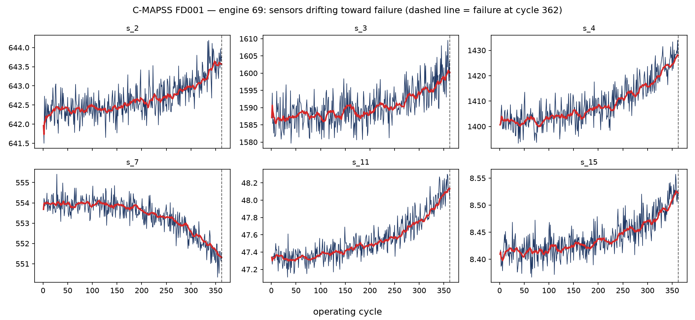

# Turbine — Predictive Maintenance Intelligence

**Deep time-series models that predict Remaining Useful Life with calibrated uncertainty — and an agentic maintenance engineer that diagnoses the failure and drafts the work order.**

   

> 🚧 **Work in progress** — built in public, phase by phase, one verified checkpoint at a time. Numbers below are verified as of Phase 0; findings land as each phase ships.

---

## Why

Unplanned downtime is the canonical industrial-AI cost center: a single offshore wind-turbine failure can run **€100K+** once crane vessels and lost production are counted, and unplanned outages cost heavy industry tens of billions per year. Yet most operations still run **calendar-based maintenance** — replacing healthy parts on schedule while missing the sick ones. The information needed to do better is already streaming off the sensors.

**Turbine does two things scheduled maintenance cannot:**

1. A **deep time-series model** reads raw multivariate sensor streams and predicts **Remaining Useful Life (RUL) with calibrated uncertainty** — not "inspect every 6 months" but *"engine 73 has 22 ± 6 cycles left."*
2. An **agentic maintenance engineer** (LLM + sensor-evidence tools + RAG over technical documentation) diagnoses the probable failure mode and **drafts the work order** — component, procedure, parts, urgency, with document citations. Every draft is stamped **PENDING ENGINEER REVIEW**. *AI suggests; the engineer decides and schedules.*

Every claim gets measured: the deep model against a tuned gradient-boosting baseline on the public **NASA C-MAPSS** benchmark (published numbers for context), uncertainty via **empirical interval coverage**, alerting as **lead time at a fixed false-alarm rate**, and the copilot's work orders via a **cross-family LLM judge validated against blind human labels (Cohen's κ)** — the same evaluation methodology validated in [Tracer](https://github.com/hugocorreia123/tracer-aml-graph-intelligence) (κ = 0.942) and [Voyager](https://github.com/hugocorreia123/voyager) (κ = 0.95).

This is what the model has to learn to read — an engine's sensors drifting toward failure:



## Data

- **[NASA C-MAPSS](https://www.kaggle.com/datasets/behrad3d/nasa-cmaps)** — the canonical turbofan run-to-failure benchmark. Four subsets (FD001 → FD004) of increasing difficulty; 21 sensors + 3 operating settings per cycle; exact cycles-to-failure labels; **published RMSE/score results for every major architecture** — the numbers to beat.
- **EDP open wind-turbine SCADA** (Phase 6) — real 10-minute SCADA signals with **labeled component failures** from a Portuguese energy operator: the "does it survive real, messy data" chapter.

Verified Phase 0 numbers (FD001):

| | |
|---|---|
| Train | 100 engines · 20,631 cycles · run-to-failure |
| Test | 100 engines · truncated trajectories · official RUL file (7–145 cycles remaining) |
| Trajectory length | 128 – 362 cycles (median 199) |
| Sensors | 21 total; **7 conventionally flat** (s1, s5, s6, s10, s16, s18, s19) confirmed and dropped; borderline s8/s13 kept — documented choice |
| Operating conditions | FD001 confirmed effectively single-condition (settings ~constant) |
| RUL labeling | piecewise-linear, **capped at 125 cycles** (benchmark convention — early life is healthy, not linearly dying) |

## The system (planned architecture)

```
Sensor streams (21 sensors × cycles per engine)
   │  windowing + per-condition normalization
   ▼
RUL MODELS:  LightGBM on rolled features (honest baseline)
             → Temporal CNN (champion candidate)
             → quantile head: RUL p10 / p50 / p90 (uncertainty)
   │  per-asset RUL + interval + health index
   ▼
ALERTING:  threshold on p10 → degrading-asset queue
           (lead time vs false-alarm rate operating point)
   ▼
AGENTIC MAINTENANCE ENGINEER (LangGraph ReAct)
   tools: asset summary · sensor trends · RUL forecast · search_docs (RAG)
   → diagnosis + WORK ORDER draft (component, procedure, parts,
     urgency, doc citations) — DRAFT · PENDING ENGINEER REVIEW
```

**Stack:** Python 3.11 · uv · PyTorch (TCN, quantile loss) · LightGBM · scikit-learn · LangGraph + Groq (qwen3-32b copilot, gpt-oss-120b judge) · Chroma · Streamlit + Plotly

## Roadmap

- [x] **Phase 0 — Data + first look**: FD001 loaded and characterized; flat sensors measured (7 conventional + 2 borderline); single-condition confirmed; degradation visual
- [x] **Phase 1 — Honest baseline**: capped RUL labels, rolled-window features, split by engine, LightGBM → RMSE + asymmetric NASA score
- [x] **Phase 2 — Deep model (corrected)**: a single TCN does **not** beat the GBM — **16.04 ± 0.88 over 5 seeds vs 14.98** (an initial 12.66 was test-set variance, caught by multi-seed evaluation); a 5-seed deep ensemble marginally edges RMSE (**14.65**) but loses the safety-weighted NASA score (409 vs 338). Finding: at FD001 scale, a well-tuned GBM is genuinely hard to beat, and the 100-engine test makes single-run claims unreliable
- [x] **Phase 3 — Uncertainty**: quantile TCN (p10/p50/p90, pinball) + **conformal calibration (CQR)** — raw intervals under-covered (62%), conformal correction (±2.5 cycles) brings test coverage to **76%** (target 80%, n=100 → binomial noise ±4%); mean interval ~29 cycles
- [x] **Phase 4 — Operating point**: threshold sweep, detection vs false alarms vs lead time (H=30) — **GBM point policy wins: 100% detection, 1.3% false alarms, 17.7 cycles mean lead** (T=35); the conformal-p10 policy was dominated (96%/4.0%). Finding: threshold sweeps on point predictions are implicit risk adjustment; calibrated quantiles are kept for *risk communication*, not alerting. Illustrative €4.7M per 100 assets vs run-to-failure (assumptions stated)
- [ ] **Phase 5 — FD004**: six operating conditions, two fault modes; per-condition normalization
- [ ] **Phase 6 — Real world**: EDP wind SCADA — failure-within-horizon prediction, per-component PR-AUC, honest label-scarcity notes
- [ ] **Phase 7 — Agentic maintenance engineer**: sensor-evidence tools + docs RAG → cited work orders, healthy-asset "no action" path
- [ ] **Phase 8 — Evaluation**: diagnosis accuracy vs labeled failures; work-order groundedness via cross-family judge; blind human labels → Cohen's κ
- [ ] **Phase 9 — Demo**: fleet view → degrading asset → RUL fan chart + work-order panel (Streamlit Community Cloud)
- [ ] **Phase 10 — Findings-first README**

## Reproduce Phase 0

```bash
git clone https://github.com/hugocorreia123/turbine-predictive-maintenance
cd turbine-predictive-maintenance && uv sync
# Kaggle API token required (~/.kaggle/kaggle.json)
uv run kaggle datasets download behrad3d/nasa-cmaps -p data/raw --unzip
uv run python scripts/explore_cmapss.py
```

## Related work by me

Turbine is the **physical-world** chapter of a detect → investigate → human-decide pattern: [Tracer](https://github.com/hugocorreia123/tracer-aml-graph-intelligence) applies it to financial-crime networks (GraphSAGE + agentic SAR investigator, κ = 0.942), [Sentinel](https://github.com/hugocorreia123/sentinel-fraud-mlops) covers transaction-level fraud MLOps, and [Voyager](https://github.com/hugocorreia123/voyager) established the judge-validation methodology (κ = 0.95).

---

*Hugo Correia — [LinkedIn](https://www.linkedin.com/in/hugogncorreia) · Data Scientist / ML & AI Engineer, Lisbon*
