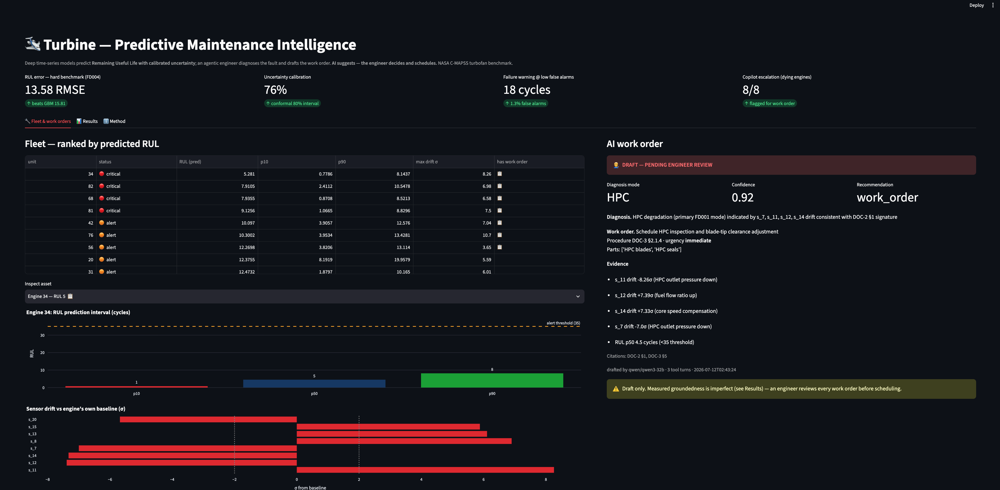
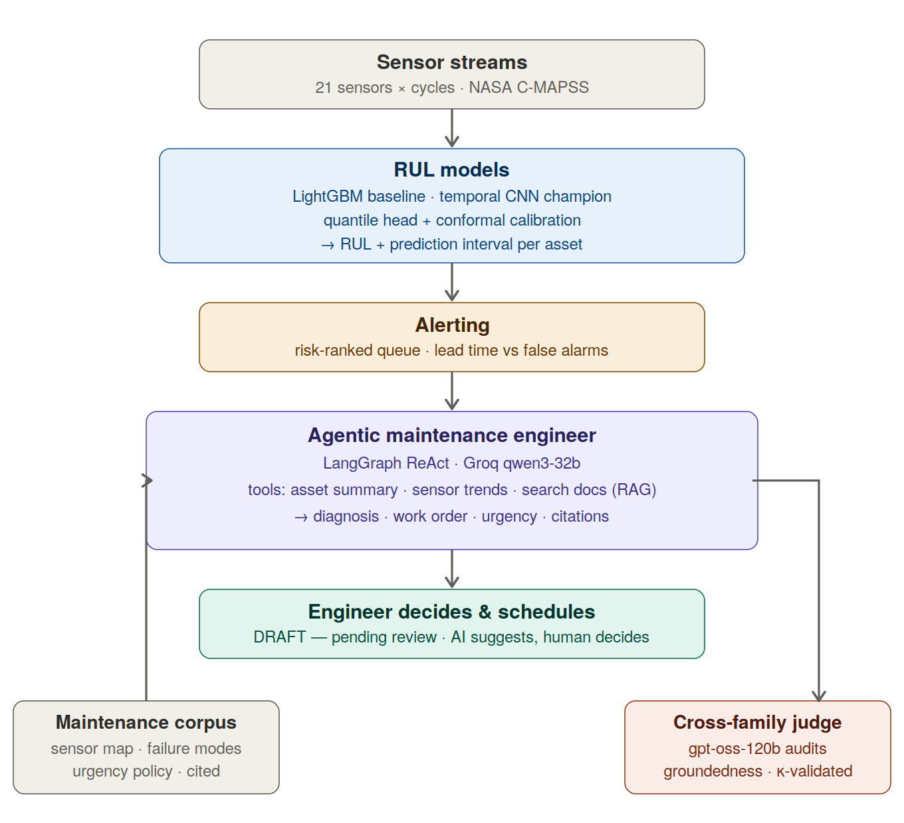
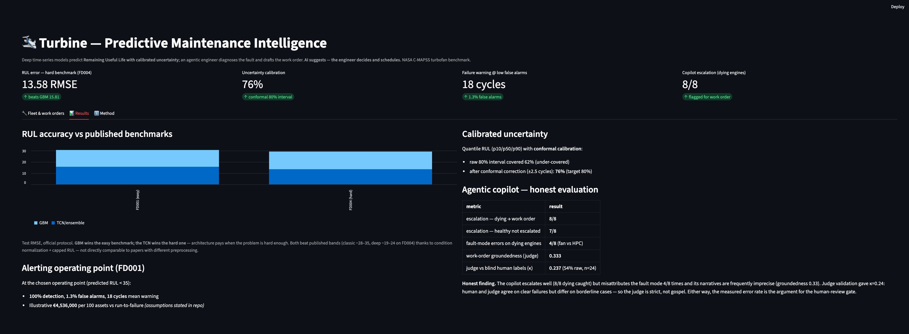
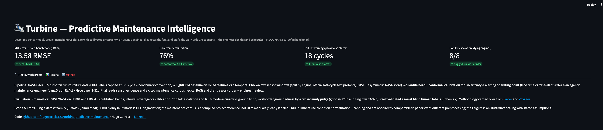

# Turbine — Predictive Maintenance Intelligence

**Deep time-series models that predict Remaining Useful Life with calibrated uncertainty — and an agentic maintenance engineer that diagnoses the fault and drafts the work order, with every claim measured.**

   

**[Live demo](https://turbine-predictive-maintenance.streamlit.app)** · **[Code](https://github.com/hugocorreia123/turbine-predictive-maintenance)**

The demo is an **asset console**: pick an engine and its remaining life, confidence window, sensor drift and work order follow instantly — with a plain-language tour, one-sentence metric explanations, and an honesty box built into the interface.

---

## Results

| Claim | Evidence |
|---|---|
| **Architecture pays when the problem is hard enough** | On easy FD001, a tuned GBM beats the deep model (14.98 vs 16.04 ± 0.88 RMSE over 5 seeds). On hard FD004 (6 conditions, 2 fault modes), the temporal CNN wins on every seed — **ensemble 13.58 RMSE vs GBM 15.81**, and beats the safety-weighted NASA score (1008 vs 1270) |
| **Single-run deep-learning "wins" are often noise** | An initial FD001 TCN scored 12.66 and looked like a +15% win; a 5-seed sweep exposed it as test-set variance (true mean 16.04). The correction is committed — measurement over wishful reporting |
| **Predictions carry calibrated uncertainty** | Quantile RUL (p10/p50/p90); raw 80% interval under-covered at 62%, **conformalized (CQR) to 76%** (target 80%, n=100 → binomial noise ±4%) |
| **Failure warning with almost no false alarms** | At the chosen operating point: **100% detection, 1.3% false alarms, ~18 cycles of lead time** — illustrative €4.7M / 100 assets vs run-to-failure (assumptions stated) |
| **The agentic copilot needs its human gate — and here's the number** | Escalation is reliable (**8/8 dying engines flagged, 7/8 healthy correctly not**), but the copilot misattributes the fault mode **4/8 times** and a cross-family judge scores work-order groundedness at **0.333**. That measured error rate is the argument for human review — not a slogan |
| **The judge itself was validated (and the validation was informative)** | Blind human labels vs the LLM judge: **Cohen's κ = 0.237**. Low *by design insight*: human and judge agree perfectly on clearly-broken outputs (4/4) but split on the PARTIAL/UNGROUNDED boundary — LLM-as-judge is reliable for catching clear failures, not yet for grading borderline groundedness |



## The problem

Unplanned downtime is the canonical industrial-AI cost center: a single offshore wind-turbine failure can exceed **€100K** once crane vessels and lost production are counted, and unplanned outages cost heavy industry tens of billions per year. Yet most operations still run **calendar-based maintenance** — replacing healthy parts on a schedule while missing the ones that are actually failing. The information needed to do better is already streaming off the sensors; the gap is turning it into a decision.

**Turbine closes that gap in two stages:** a model that says *when* ("engine 34 has ~5 cycles left, 80% interval [1, 8]"), and an agent that says *what to do about it* ("HPC degradation — schedule blade-tip inspection, urgency immediate") — with a human engineer signing off before anything is scheduled.

## Architecture



Evaluation is cross-family and human-validated (the methodology carried over from [Voyager](...) and [Tracer](...)): a `gpt-oss-120b` judge audits...

**Evaluation is cross-family and human-validated** (the methodology carried over from [Voyager](https://github.com/hugocorreia123/voyager) and [Tracer](https://github.com/hugocorreia123/tracer-aml-graph-intelligence)): a `gpt-oss-120b` judge audits the `qwen3-32b` agent's work orders for groundedness and citation faithfulness, and the judge itself is validated against blind human labels with Cohen's κ.

## Data

- **[NASA C-MAPSS](https://www.kaggle.com/datasets/behrad3d/nasa-cmaps)** — the canonical turbofan run-to-failure benchmark. Four subsets of increasing difficulty; 21 sensors + 3 operating settings per cycle; exact cycles-to-failure labels; **published RMSE/score results for every major architecture**, which makes each of our numbers self-locating. FD001 (single operating condition, single fault mode) is the warm-up; **FD004** (six conditions, two fault modes, ~250 engines) is the hard benchmark.
- **Maintenance corpus** — three sectioned reference documents (sensor map, failure-mode signatures, maintenance/urgency policy) compiled for this project from the public C-MAPSS documentation (Saxena et al., 2008) and standard turbomachinery FMEA practice. Clearly labeled as a compiled reference rather than OEM manuals — and because it is small and section-numbered, **the copilot's citations are objectively auditable**.

## What was built, phase by phase

**Baseline (FD001).** RUL labels are piecewise-linear capped at 125 cycles (the benchmark convention — early life is healthy, not linearly dying). Split is **by engine** (never by row — that would leak trajectories), and evaluation follows the official protocol: the last cycle of each test engine against the supplied RUL file. Metrics are RMSE and the **asymmetric NASA score**, which penalizes *late* predictions harder than early ones — because missing a failure costs more than an early inspection. A tuned LightGBM on rolled-window features scored **test RMSE 14.98** — already better than the published classic-ML band (~16–20).

**Deep model.** A temporal CNN (dilated 1-D convolutions, ~57K parameters) consumes raw sensor windows with no hand-engineered features. The first attempt *lost* to the baseline — and the honest handling of that is a highlight: a single tuned run hit 12.66 and looked like a 15% win, but a **5-seed sweep revealed test-set variance** (true mean **16.04 ± 0.88**). On FD001's 100-engine test, a strong GBM is genuinely hard to beat, and single-run deep-learning claims are unreliable. The correction is committed.

**Uncertainty.** The point head is swapped for a **quantile head** (p10/p50/p90, pinball loss) — RUL as an interval, not a guess. Raw intervals under-covered (80% nominal → 62% empirical), so a **conformal calibration step (CQR)** on the validation engines expands the band by a fixed amount to reach **76%** coverage. This is the capability no point-estimate portfolio has: *calibrated* risk that an operator can plan against.

**Operating point.** Alerting sweeps a threshold on predicted RUL and reports **lead time vs false-alarm rate**. A finding fell out of this: the plain point-prediction policy *beat* the risk-averse p10 policy (100% detection / 1.3% false alarms / ~18 cycles lead vs 96% / 4.0%) — because sweeping a threshold on point predictions is itself an implicit risk adjustment. The quantiles are kept for *communicating* risk (the fan chart, the work order), not for triggering alerts.

**Hard benchmark (FD004).** Six operating conditions mean sensors shift with the operating mode, so **per-condition normalization** (KMeans clustering of the settings, then z-scoring within each cluster) is essential — normalize globally and the model learns operating modes instead of health. Here the story flips: the **temporal CNN wins on every seed** (14.26 ± 0.66 vs the GBM's 15.81), and the 3-seed ensemble reaches **13.58 RMSE / NASA 1008**, beating the GBM on both. The two benchmarks together make the point no single dataset could: *classical ML is a formidable baseline on easy problems, and deep sequence models earn their complexity as the problem gets harder.*

**Agentic maintenance engineer.** A ReAct agent investigates one flagged engine at a time through evidence tools (RUL forecast, per-sensor drift vs the engine's own baseline) and a **lexical-RAG search over the sectioned corpus**, then drafts a work order with a diagnosis, an urgency drawn from the policy ladder, parts, and **citations to specific corpus sections**. Crucially, the agent never receives a computed fault label — diagnosis is inference from evidence, and a healthy engine is expected to yield "no action." Every draft is stamped **PENDING ENGINEER REVIEW**.

**Evaluation.** On 24 engines stratified by true health (which the agent never sees):

| dimension | result |
|---|---|
| escalation — dying engines → work order | **8/8** |
| escalation — healthy engines not escalated | **7/8** |
| fault-mode accuracy on dying engines | **4/8** correct (the other 4 called fan-section on an HPC-only dataset) |
| work-order groundedness — cross-family judge (gpt-oss-120b) | **0.333** mean (2 grounded / 12 partial / 10 ungrounded) |
| judge validity — blind human labels, Cohen's κ | **0.237** (54% raw agreement, n=24) |

The judge's typed issue taxonomy (23 misattributed citations, 14 urgency-policy violations, 8 direction errors, 5 sensor-misnamings) localizes exactly *how* the narratives fail: the agent's structural reasoning and escalation are sound, but its cited details are unreliable. And the κ tells a second-order story — human and judge agree completely on clearly-broken outputs but diverge on borderline ones, so **LLM-as-judge is trustworthy for detecting clear failures, not yet for grading nuance**. An unvalidated single-judge score would have hidden that.

## Demo

An interactive fleet view: assets ranked by predicted RUL, and for any engine, its RUL prediction interval, its sensor-drift cascade (red past 2σ), and the AI-drafted work order beside them — stamped for engineer review.



The results tab shows the project's own limitations, including the κ = 0.237 finding — the demo is as honest as the repo.



## Key findings

1. **Architecture pays when the problem is hard enough** — GBM wins FD001, the TCN wins FD004; the two-benchmark contrast is the headline.
2. **Multi-seed evaluation is not optional** — a single-run 12.66 "win" was variance; the truth was 16.04 ± 0.88.
3. **Calibrated uncertainty is achievable and worth it** — conformal quantiles reach ~80% coverage and let alerts express risk aversion.
4. **Point + threshold can beat calibrated quantiles for alerting** — a measured, slightly counter-intuitive operating-point result.
5. **Agentic copilots reason well and narrate imprecisely** — 8/8 escalation but 4/8 mode errors and 0.333 groundedness; the human gate is a measured necessity, and validating the judge (κ = 0.237) revealed that LLM judges themselves have a reliability ceiling on borderline cases.

## Stack

Python 3.11 · uv · PyTorch (temporal CNN, quantile regression) · LightGBM · scikit-learn (KMeans, conformal calibration) · LangGraph + Groq (`qwen3-32b` copilot, `gpt-oss-120b` judge) · Streamlit + Plotly · Streamlit Community Cloud

## Reproduce

```bash
git clone https://github.com/hugocorreia123/turbine-predictive-maintenance
cd turbine-predictive-maintenance && uv sync
# Kaggle API token required (~/.kaggle/kaggle.json)
uv run kaggle datasets download behrad3d/nasa-cmaps -p data/raw --unzip

uv run python scripts/explore_cmapss.py     # Phase 0 — data + degradation plot
uv run python scripts/make_dataset.py       # capped RUL, rolled features, engine split
uv run python scripts/train_baseline.py     # LightGBM baseline (RMSE 14.98)
uv run python scripts/train_tcn.py --seed 42  # temporal CNN (multi-seed: 42..46)
uv run python scripts/eval_ensemble.py      # 5-seed ensemble
uv run python scripts/train_quantile.py     # quantile RUL + conformal calibration
uv run python scripts/operating_point.py    # lead time vs false-alarm rate
uv run python scripts/run_fd004.py          # hard benchmark (per-condition norm)
uv run python scripts/build_corpus.py       # maintenance corpus + engine evidence
uv run python scripts/copilot.py --top 5    # agentic work orders (needs GROQ_API_KEY)
uv run python scripts/eval_copilot.py       # escalation + mode + citation metrics
uv run python scripts/judge_workorders.py   # cross-family groundedness judge
uv run python scripts/label_workorders.py   # blind human labels → Cohen's κ
uv run streamlit run app.py                 # the demo
```

## Scope & limitations

Single dataset family (C-MAPSS, simulated — real SCADA is messier); FD001's only simulated fault mode is HPC degradation, which is what makes the copilot's fan-section diagnoses countable errors; the maintenance corpus is a compiled project reference, not OEM manuals (labeled as such); RUL numbers use condition normalization and RUL capping and are **not directly comparable** to papers with different preprocessing; the € figure is an illustrative scaling with stated assumptions; the copilot evaluation is n=24 (small — directional, not definitive).

## Related work by me

Turbine is the **physical-world** chapter of a detect → investigate → human-decide pattern applied across domains: [Tracer](https://github.com/hugocorreia123/tracer-aml-graph-intelligence) applies it to financial-crime networks (GraphSAGE + agentic SAR investigator, judge κ = 0.94), [Sentinel](https://github.com/hugocorreia123/sentinel-fraud-mlops) covers transaction-level fraud MLOps, and [Voyager](https://github.com/hugocorreia123/voyager) established the cross-family judge-validation methodology (κ = 0.95). Together they span financial and physical systems, transaction and network and sensor data, with the same discipline throughout: an honest baseline, measured findings including the negative ones, and a human in the loop by design.

---

*Hugo Correia — [LinkedIn](https://www.linkedin.com/in/hugogncorreia) · [GitHub](https://github.com/hugocorreia123) · Data Scientist / ML & AI Engineer, Lisbon*
